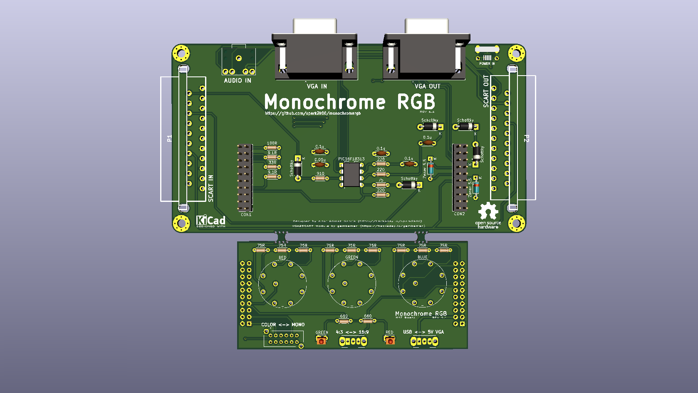
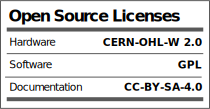

# MonochromeRGB

MonochromeRGB is a project to enjoy the charm of those monochrome monitors of the time but in the current video systems, those with VGA or SCART inputs. Where this product is most enjoyed is in CRT monitors, where the feeling of an old monitor is much more realistic.

https://hackaday.io/project/176201-monochromergb

Coworked with Gambaman, when integrating the VGA2SCART module: 

https://hackaday.io/project/165634-the-ultimate-vga-to-scart-adapter

